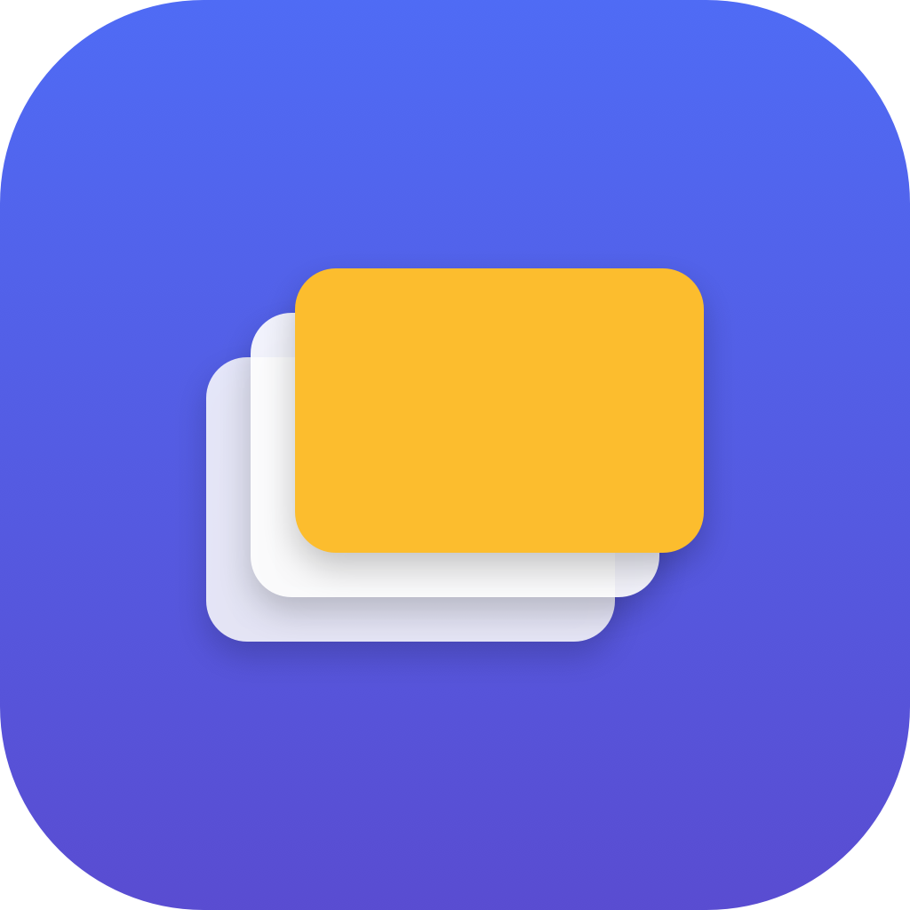

<p align="center">
  
</p>

<h1 align="center">Decks</h1>

<p align="center">
  Notes for macOS, organized by context — built so the things you switch between never bleed into each other, with deep Claude integration.
</p>

<p align="center">
  
  
  
</p>

Each project or context you switch between is a *deck*. A deck holds six sections:

- **Daily** — a dated log for standups and things to bring up.
- **To-dos** — what to do or review, with checkboxes, optional due dates and reminders.
- **Notes** — a free markdown scratchpad: decisions, people, context.
- **Links** — quick access to repos, dashboards and docs.
- **Meetings** — this deck's calendar events, today and upcoming, with one-click Join.
- **Time** — focused time you've put into this context, by day.

Open the app, pick the deck, and you are back where you left off — instead of digging through one giant notes file. Daily and Notes use a live-styled markdown editor: it styles as you type, no edit/preview mode.

## Install

```
git clone https://github.com/francopocatino/decks
cd decks
./scripts/install.sh        # builds Decks.app and installs it to /Applications
```

That builds a native `Decks.app`, installs it, and launches it. Right-click the Dock icon and choose Options > Keep in Dock. To run from source instead: `swift run --package-path app`.

## What it does

**Organize**

- Native macOS app (SwiftUI), no Electron.
- One deck per project or context: rename / archive / delete, drag-to-reorder, a per-deck color, and a sidebar that shows open to-do counts.
- Sub-decks: nest projects under a parent (one level). A sub-deck inherits the parent's connector, commit email, git provider, instructions and calendar when its own are empty, and sees the parent's links — to-dos and dailies stay per sub-deck.
- Tiling layout: split a deck into up to four panes (right or down, resizable) so the daily, notes and to-dos sit side by side.

**Move fast**

- **Command palette (⌘K)** — fuzzy-jump to any deck or run an action.
- **Quick capture** — a global hotkey (and a menu-bar item) drops a to-do or daily line into any deck without leaving what you're doing.
- **Pop-out windows** — detach any section into a minimal floating window that stays on top, so the daily can sit next to a call.
- **Today** — a cross-deck launchpad: a pulse card per deck (open/overdue to-dos, time today, next meeting, latest daily line) plus the full day's meeting agenda.
- **Pomodoro** — a focus timer with a menu-bar countdown, a floating ring, and a global start/pause hotkey.

**Apple stack**

- Meetings from your calendars (EventKit), scoped per deck (today / upcoming); Join opens the meeting link.
- Notifications: meeting alerts (configurable lead time, with Join) and to-do due alerts.
- Apple Reminders two-way sync, opt-in per deck (to-dos and due dates).
- Time tracking: attributes your awake, non-idle time to the active deck.
- Spotlight indexing of decks, to-dos, links, notes and dailies.
- Optional one-way iCloud Drive markdown mirror, readable from Files on iPhone.

**AI & automation**

- Contextual AI (the sparkles button): **Draft** a daily from the deck's open to-dos and notes, or **Polish** its notes — with an API-key Claude/OpenAI connector, or on-device Apple Intelligence when no key is set.
- Per-deck identity: git provider and commit email, project folders, the deck's connector, and AI instructions (language, daily format, tone). Secrets live in the macOS Keychain.
- A Rust CLI and an MCP server so Claude can read and write your decks.
- Worklog: turn a day's git commits (and your GitHub/GitLab pull/merge requests) into a daily entry.
- Live sync: edits from the CLI or an agent show up in the open app within a second or two.
- In-app update check; releases published on `v*` tags.

## Contextual AI

Daily and Notes each have a sparkles button. In **Daily** it drafts today's entry from the deck's open to-dos and notes; in **Notes** it polishes the current notes into cleaner markdown, keeping every piece of information. It uses the deck's AI connector — Claude or OpenAI, with the API key in the Keychain — when one is set, and otherwise falls back to on-device **Apple Intelligence**, so it still works without a key on a supported Mac.

Each deck also carries free-form AI instructions (in deck settings) — language, daily format, tone. The drafter prepends them, and Claude reads them from `show_deck` over the MCP server, so a daily drafted in one deck comes out in English bullets while another comes out in Spanish prose, per deck. Login-mode Claude decks drive this through Claude Code over the MCP server instead of an in-app key.

## Claude integration (MCP)

`decks-mcp` is an MCP server that exposes every deck operation as a tool, addressed by deck id. Register one global server:

```
cargo install --path cli                 # puts decks + decks-mcp on PATH
claude mcp add decks -- ~/.cargo/bin/decks-mcp
```

Then ask Claude — in Claude Code or Claude Desktop — to operate any deck by name:

- "add a to-do to acme: review the deploy"
- "fill the daily of nexus with what we did this session"
- "archive invicto"

`decks mcp-config` prints the ready-to-paste config. To keep an account isolated, register a server **scoped** to one deck in that account's client only: `decks-mcp --deck <slug>` — it can never see another deck. The account boundary is which client/login you register the server in.

## CLI

The CLI reads and writes the same files as the app, and is the surface meant for automation.

```
cd cli
cargo run -- list                       # decks with open to-do counts
cargo run -- new "Acme"                 # create a deck
cargo run -- add acme "review PR 214"   # add a to-do
cargo run -- done acme 0                # toggle a to-do
cargo run -- note acme "use sqlite"     # append a note
cargo run -- daily acme "shipped auth"  # add a dated daily entry
cargo run -- show acme --json           # machine-readable output
```

Also: `link`/`unlink`, `remove`/`edit` (to-do), `reorder`/`set-parent`/`rename`/`archive`/`unarchive`/`delete` (deck), `open`, `worklog`, `which`. Every action is exposed as an MCP tool too.

## Worklog

`decks worklog <slug>` scans the deck's folders for git repositories, collects today's commits filtered to the deck's commit email, and prepends them to the daily log. A repo whose `origin` remote doesn't match the deck's git provider is skipped, so one context's commits never land in another's worklog. If the deck points at a GitHub or GitLab connector, it also adds today's pull/merge requests you authored — the token is read from the macOS Keychain. `decks which <path>` resolves a path to the deck whose folder contains it — together they make a Claude Code SessionEnd hook so each coding session captures itself into the right deck. Install it with:

```
decks hook install        # adds the SessionEnd hook to ~/.claude/settings.json (decks hook uninstall removes it)
```

It runs `deck=$(decks which "$CLAUDE_PROJECT_DIR"); [ -n "$deck" ] && decks worklog "$deck"` — a no-op in projects that don't belong to a deck.

## How it stores data

Everything is plain files under `~/.decks` (override with `DECKS_DIR`): JSON for structured data, markdown for free text. The on-disk format is the only contract between the app and the CLI — see [docs/format.md](docs/format.md). Secrets are never written to disk; they live in the macOS Keychain.

## Automation

Shortcuts (including Focus automations) and SSH from the iPhone or Watch can drive Decks through the CLI — recipes in [docs/automation.md](docs/automation.md).

## Development

```
swift build  --package-path app                                  # app
swift test   --package-path app
cargo build  --manifest-path cli/Cargo.toml                      # cli + mcp
cargo test   --manifest-path cli/Cargo.toml
cargo fmt    --manifest-path cli/Cargo.toml --check
cargo clippy --manifest-path cli/Cargo.toml --all-targets -- -D warnings
```

CI runs all of the above on every pull request. Changes go through a branch and a pull request; commits are atomic; English only.

## License

MIT — see [LICENSE](LICENSE).
